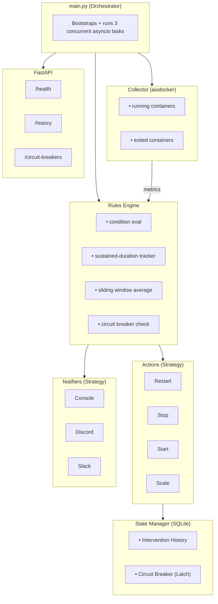

<p align="center">
  <a href="https://github.com/soneylegal/sentinel/actions/workflows/ci.yml"></a>
  
  
  
  
  
  
</p>

<h1 align="center">🛡️ Sentinel</h1>
<h3 align="center">Docker Autonomous Orchestrator & Monitor</h3>

<p align="center">
  Daemon assíncrono e autônomo para operações de Infraestrutura e DevOps.<br/>
  Monitora métricas via Docker Socket, executa ações corretivas automáticas<br/>
  e previne crash loops com um Circuit Breaker integrado.
</p>

---

## 📋 Índice

- [Visão Geral](#-visão-geral)
- [Quick Start (Apenas Docker)](#-quick-start-apenas-docker)
- [Stack Tecnológico](#-stack-tecnológico)
- [Arquitetura](#-arquitetura)
- [Design Patterns](#-design-patterns)
- [Estrutura de Diretórios](#-estrutura-de-diretórios)
- [Instalação](#-instalação)
- [Configuração](#-configuração)
- [Uso](#-uso)
- [API de Observabilidade](#-api-de-observabilidade)
- [Segurança](#-segurança)
- [Testes](#-testes)
- [Deploy com Docker Compose](#-deploy-com-docker-compose)
- [Licença](#-licença)

---

## 🔭 Visão Geral

O **Sentinel** é um daemon enterprise-grade que opera de forma autônoma sobre a sua infraestrutura Docker. Ele:

- **Coleta métricas** (CPU, RAM, Health Status) de todos os containers em execução via Docker Socket — de forma totalmente assíncrona e non-blocking.
- **Monitora containers parados** (`exited`) com exit codes anormais (1, 137, 255) e tenta recuperá-los automaticamente.
- **Avalia regras** definidas em YAML contra as métricas coletadas, com suporte a duração sustentada (a condição precisa persistir por N segundos antes de agir) e suavização de métricas via sliding window average.
- **Executa ações corretivas** automáticas: restart, stop, start, scale (via `docker compose`).
- **Previne Crash Loop BackOff** com um Circuit Breaker apoiado em SQLite — se um container for reiniciado mais de N vezes em M minutos, o CB permanece aberto permanentemente até reset manual via API.
- **Notifica** via múltiplos canais (Console, Discord, Slack) usando o padrão Strategy. Notificações do Circuit Breaker incluem os últimos logs do container para diagnóstico rápido.
- **Expõe uma API interna** para observabilidade do seu próprio estado.

---

## 🧱 Stack Tecnológico

| Componente | Tecnologia | Propósito |
|---|---|---|
| **Linguagem** | Python 3.11+ | Tipagem forte via `mypy` strict |
| **Docker** | `aiodocker` | Cliente assíncrono para o Docker Daemon |
| **API** | FastAPI + Uvicorn | Servidor de observabilidade embutido |
| **Banco de Dados** | SQLite + `aiosqlite` | Histórico de intervenções e estado do Circuit Breaker |
| **Logging** | Loguru | Logs estruturados em JSON (Datadog/ELK-ready) |
| **Configuração** | Pydantic Settings | Validação rigorosa de `.env` e `rules.yaml` |
| **Notificações** | `aiohttp` | Webhooks assíncronos para Discord e Slack |
| **Lint / Type Check** | `ruff` + `mypy` | Qualidade e formatação de código |
| **Testes** | `pytest` + `pytest-asyncio` | 234 testes unitários e de integração |
| **CI/CD** | GitHub Actions | Matrix Python 3.11/3.12/3.13 |

---

## 🏗️ Arquitetura

O Sentinel segue os princípios de **Clean Architecture**, separando responsabilidades em módulos independentes e intercambiáveis.



### Fluxo de Execução

1. **Collector** consulta o Docker Daemon e normaliza métricas (compatível com cgroup v1/v2, Linux/macOS/WSL). Também coleta containers em `exited` com exit codes anormais.
2. **Rules Engine** cruza métricas com as regras configuradas, aplicando sliding window average para suavização de métricas.
3. Se a condição for satisfeita pelo tempo sustentado, o engine consulta o **State Manager**.
4. Se o **Circuit Breaker** estiver fechado, a **Action** é executada e uma **Notification** é enviada.
5. Se o **Circuit Breaker** estiver aberto (muitos restarts recentes), a ação é suspensa, os últimos logs do container são coletados, e um alerta CRITICAL é emitido para intervenção humana. O CB permanece aberto até reset manual via API.

---

## 🎯 Design Patterns

### Strategy Pattern
Os módulos `actions/` e `notifiers/` implementam interfaces abstratas (`BaseAction`, `BaseNotifier`). O engine invoca polimorficamente sem saber qual implementação concreta está em uso.

```python
# O engine não sabe se é Restart, Stop, Start ou Scale
await action.execute(container_id, container_name, timeout)

# O engine não sabe se é Console, Discord ou Slack
await notifier.send(title, message, severity, container_name)
```

### Observer Pattern
O Rules Engine observa o fluxo de métricas do Collector de forma assíncrona a cada ciclo de polling, reagindo a mudanças de estado.

### Circuit Breaker / State Pattern
O State Manager mantém um registro persistente (SQLite) de todas as intervenções. Antes de executar qualquer ação:

```
"O CB já está aberto (is_open=1) para este container?"
├── SIM → Circuit Breaker PERMANECE ABERTO → Alerta humanos com logs
└── NÃO → "Eu já reiniciei esse container N vezes nos últimos M minutos?"
           ├── NÃO → Executa a ação normalmente
           └── SIM → Latch: marca is_open=1 → Suspende ação → Alerta humanos
```

O Circuit Breaker permanece aberto **permanentemente** após ser acionado. O reset só ocorre via `POST /circuit-breakers/{name}/reset`.

### Fail Fast
A configuração (`.env` + `rules.yaml`) é validada rigorosamente via Pydantic **antes** do daemon inicializar. Regex inválido, métricas desconhecidas, ou campos obrigatórios ausentes impedem a inicialização.

---

## 📂 Estrutura de Diretórios

```
sentinel/
├── src/
│   ├── __init__.py
│   ├── main.py                     # Orquestrador asyncio
│   ├── core/
│   │   ├── config.py               # Pydantic Settings + YAML Schema
│   │   ├── logger.py               # Loguru JSON estruturado
│   │   └── exceptions.py           # Exceções customizadas
│   ├── collectors/
│   │   └── docker_async.py         # aiodocker + normalização cross-platform + exited
│   ├── engine/
│   │   ├── rules.py                # Motor de regras + sustained-duration + sliding window
│   │   └── state_manager.py        # SQLite + Circuit Breaker (latch permanente)
│   ├── actions/
│   │   ├── base.py                 # Interface abstrata (Strategy)
│   │   ├── restart.py              # RestartAction + StopAction
│   │   ├── start.py                # StartAction (containers exited)
│   │   └── scale.py                # ScaleComposeAction
│   ├── notifiers/
│   │   ├── base.py                 # Interface + ConsoleNotifier
│   │   ├── discord.py              # Rich embeds via webhook
│   │   └── slack.py                # Block Kit via webhook
│   └── api/
│       ├── server.py               # Uvicorn como asyncio task
│       └── routes.py               # Endpoints de observabilidade
├── tests/
│   ├── conftest.py                 # Fixtures centralizadas + mocks
│   ├── test_config.py              # Validação Pydantic (93 testes)
│   ├── test_state_manager.py       # SQLite + Circuit Breaker (42 testes)
│   ├── test_rules_engine.py        # Matching + Conditions + CB logs (22 testes)
│   ├── test_exited_recovery.py     # Exited container recovery (26 testes)
│   ├── test_api.py                 # Endpoints FastAPI (47 testes)
│   └── test_collector.py           # Collector metrics + normalization (4 testes)
├── .github/
│   └── workflows/ci.yml            # GitHub Actions CI pipeline
├── db/                             # Banco SQLite (criado em runtime)
├── rules.yaml                      # Regras de monitoramento
├── docker-compose.yml              # Deploy com socket mount
├── Dockerfile                      # Multi-stage, non-root
├── pyproject.toml                  # pytest + mypy + ruff
├── requirements.txt                # Dependências
├── .env.example                    # Template de configuração
├── .gitignore
└── LICENSE                         # Apache License 2.0
```

---

## ⚡ Quick Start (Apenas Docker)

Para rodar o Sentinel diretamente sem precisar clonar o repositório ou instalar dependências locais, utilize a nossa imagem pública hospedada no GitHub Container Registry:

```bash
docker run -d \
  --name sentinel \
  --user root \
  --restart unless-stopped \
  -v /var/run/docker.sock:/var/run/docker.sock:ro \
  ghcr.io/soneylegal/sentinel:latest
```

> **Nota:** Ao montar o `docker.sock`, o Sentinel ganha visibilidade global para orquestrar todos os containers do host, independentemente do diretório de onde é executado.

---

## 🚀 Instalação

### Pré-requisitos

- Python 3.11+
- Docker Engine com socket acessível
- (Opcional) Docker Compose v2

### Setup local

```bash
# Clonar o repositório
git clone https://github.com/soneylegal/sentinel.git
cd sentinel

# Criar virtual environment
python3 -m venv .venv
source .venv/bin/activate

# Instalar projeto e dependências (modo editável)
pip install -e ".[dev]"

# Copiar e editar configuração
cp .env.example .env
```

---

## ⚙️ Configuração

### Variáveis de Ambiente (`.env`)

| Variável | Default | Descrição |
|---|---|---|
| `SENTINEL_DOCKER_URL` | `unix:///var/run/docker.sock` | URL do Docker Daemon |
| `SENTINEL_API_HOST` | `0.0.0.0` | Host da API de observabilidade |
| `SENTINEL_API_PORT` | `9120` | Porta da API |
| `SENTINEL_RULES_PATH` | `rules.yaml` | Caminho do arquivo de regras |
| `SENTINEL_DB_PATH` | `db/sentinel.db` | Caminho do banco SQLite |
| `SENTINEL_POLL_INTERVAL` | `15` | Intervalo de coleta em segundos |
| `SENTINEL_CIRCUIT_BREAKER_THRESHOLD` | `3` | Ações antes de desarmar o disjuntor |
| `SENTINEL_CIRCUIT_BREAKER_WINDOW_MINUTES` | `5` | Janela de tempo do disjuntor |
| `SENTINEL_LOG_LEVEL` | `INFO` | Nível de log |
| `SENTINEL_LOG_FORMAT` | `json` | Formato: `json` ou `pretty` |
| `SENTINEL_DISCORD_WEBHOOK_URL` | — | Webhook do Discord |
| `SENTINEL_SLACK_WEBHOOK_URL` | — | Webhook do Slack |


### Regras de Monitoramento (`rules.yaml`)

Cada regra define:

```yaml
rules:
  - name: "Nome da Regra"
    description: "Descrição"
    enabled: true
    match:
      container_name_pattern: ".*"     # Regex: quais containers monitorar
      exclude_patterns:
        - "^sentinel$"                 # Regex: quais excluir
        - "^postgres.*"               # Bancos de dados excluídos
    condition:
      metric: cpu_percent              # cpu_percent | memory_percent | memory_usage_mb | health_status | status | exit_code
      operator: ">"                    # > | < | >= | <= | ==
      threshold: 90.0                  # Valor limite
      sustained_seconds: 60           # Duração mínima da violação
    action:
      type: restart                    # restart | stop | start | scale
      timeout: 30                      # Timeout para ação graceful
    notify:
      channels:
        - console                      # console | discord | slack
        - discord
      severity: critical               # info | warning | critical
```

#### Regras pré-configuradas

| Regra | Condição | Ação |
|---|---|---|
| High CPU Auto-Restart | CPU > 90% por 60s | Restart |
| Memory Leak Detection | RAM > 85% por 120s | Restart |
| Unhealthy Container Watchdog | health_status == unhealthy por 30s | Restart |
| Restarting Container Watchdog | status == restarting por 30s | Restart |
| Exited Container Recovery | exit_code ∈ {1, 137, 255} | Start |

---

## ▶️ Uso

### Execução local

```bash
# Ativar venv
source .venv/bin/activate

# Iniciar o daemon
python -m src.main
```

O Sentinel irá:
1. Validar toda a configuração (Fail Fast).
2. Conectar-se ao Docker Daemon.
3. Inicializar o banco SQLite.
4. Iniciar a API de observabilidade na porta `9120`.
5. Entrar no loop de monitoramento.

### Parar o daemon

```bash
# Ctrl+C (SIGINT) ou
kill -SIGTERM <pid>
```

O Sentinel faz shutdown graceful, fechando conexões e banco de dados.

---

## 📡 API de Observabilidade

A API roda embutida no mesmo event loop do daemon (zero overhead de IPC).

| Método | Endpoint | Descrição |
|---|---|---|
| `GET` | `/health` | Status + conexão Docker + uptime |
| `GET` | `/history` | Últimas 50 intervenções autônomas |
| `GET` | `/circuit-breakers` | Estado de todos os disjuntores |
| `POST` | `/circuit-breakers/{name}/reset` | Reset manual de um disjuntor |
| `GET` | `/docs` | Swagger UI interativo |
| `GET` | `/redoc` | Documentação ReDoc |

### Exemplos

```bash
# Verificar saúde do daemon
curl -s http://localhost:9120/health | python -m json.tool
```
```json
{
    "status": "ok",
    "docker_connected": true,
    "uptime_seconds": 3421.50,
    "version": "1.0.1",
    "timestamp": "2026-07-17T12:30:00.000000+00:00"
}
```

```bash
# Ver histórico de ações
curl -s http://localhost:9120/history | python -m json.tool
```
```json
{
    "count": 2,
    "records": [
        {
            "id": 1,
            "container_id": "abc123def456",
            "container_name": "webapp",
            "rule_name": "High CPU Auto-Restart",
            "action_type": "restart",
            "success": true,
            "error_message": null,
            "created_at": "2026-07-17T12:25:00.000Z"
        }
    ]
}
```

```bash
# Ver estado dos disjuntores
curl -s http://localhost:9120/circuit-breakers | python -m json.tool
```
```json
{
    "breakers": [
        {
            "container_name": "webapp",
            "trip_count": 3,
            "last_tripped": "2026-07-17T12:25:00Z",
            "is_open": true
        }
    ]
}
```

```bash
# Resetar disjuntor manualmente
curl -s -X POST http://localhost:9120/circuit-breakers/webapp/reset | python -m json.tool
```
```json
{
    "status": "ok",
    "container_name": "webapp",
    "message": "Circuit breaker for 'webapp' has been reset. Autonomous actions are now re-enabled."
}
```

---

## 🔒 Segurança

### O que o Sentinel faz nos containers

| Operação | Risco para dados |
|---|---|
| `restart` (SIGTERM → wait → SIGKILL → start) | **Nenhum** — volumes preservados |
| `stop` (SIGTERM → wait → SIGKILL) | **Nenhum** — container para, dados intactos |
| `start` (inicia container parado) | **Nenhum** — usa mesma config e volumes |
| `scale` (docker compose scale) | **Nenhum** — cria/remove réplicas |

### O que o Sentinel NUNCA faz

O Sentinel **não possui** código para: `docker rm`, `docker rmi`, `docker volume rm`, `docker exec`, `docker build`, `docker pull`, `docker cp`, ou qualquer operação que modifique, exclua ou corrompa dados.

### Camadas de proteção

- **`exclude_patterns`** — Exclui containers críticos (bancos de dados, reverse proxies) de todas as regras.
- **Circuit Breaker permanente** — Limita a 3 ações por container, depois para permanentemente até reset manual via API.
- **`sustained_seconds`** — Espera N segundos antes de agir, evitando falsos positivos.
- **Audit trail** — Toda ação é registrada no SQLite e notificada via Discord com os logs do container.
- **Non-root container** — O Sentinel roda como usuário não-root dentro do container.
- **Docker socket read-only** — O volume mount usa `:ro` para proteger o socket no filesystem.

---

## 🧪 Testes

```bash
# Rodar todos os testes
python -m pytest tests/ -v

# Lint + Type check
ruff check src/ tests/
mypy src/ --strict


# Resultado esperado:
# ==================== 234 passed in ~4.5s ====================
```

### Cobertura de testes

| Módulo | Testes | O que valida |
|---|---|---|
| `test_config.py` | 93 | Pydantic settings, regex, YAML parsing, Fail Fast (22 cenários malformados) |
| `test_api.py` | 47 | Todos os endpoints, schemas, 503 fallback, CORS, OpenAPI, 404/405 |
| `test_state_manager.py` | 42 | SQLite CRUD, Circuit Breaker latch/trip/reset, Crash Loop, isolamento, action types |
| `test_exited_recovery.py` | 26 | Exited container detection, exit code filtering, StartAction, CB integration |
| `test_rules_engine.py` | 22 | Pattern matching, operadores, sustained-duration, exclusões, CB com logs |
| `test_collector.py` | 4 | Collector metrics, cgroup normalization |

---

## 🐳 Deploy com Docker Compose

```bash
# Build e start em background
docker compose up -d --build

# Ver logs em tempo real
docker compose logs -f sentinel

# Verificar saúde
curl http://localhost:9120/health

# Parar
docker compose down
```

### O que o `docker-compose.yml` configura:

- **Socket mount** (`/var/run/docker.sock`) em modo read-only.
- **Volume persistente** para o banco SQLite.
- **Auto-detect Docker GID** — o entrypoint detecta automaticamente o GID do socket e configura permissões.
- **Healthcheck** contra o endpoint `/health`.
- **Log rotation** (max 10MB, 3 arquivos).
- **Non-root user** no container.
- **Restart policy** `unless-stopped`.

---

## 📄 Licença

Este projeto está licenciado sob a **Apache License 2.0** — veja o arquivo [LICENSE](LICENSE) para detalhes.

```
Copyright 2026 Davi Laurindo

Licensed under the Apache License, Version 2.0 (the "License");
you may not use this file except in compliance with the License.
You may obtain a copy of the License at

    http://www.apache.org/licenses/LICENSE-2.0
```
